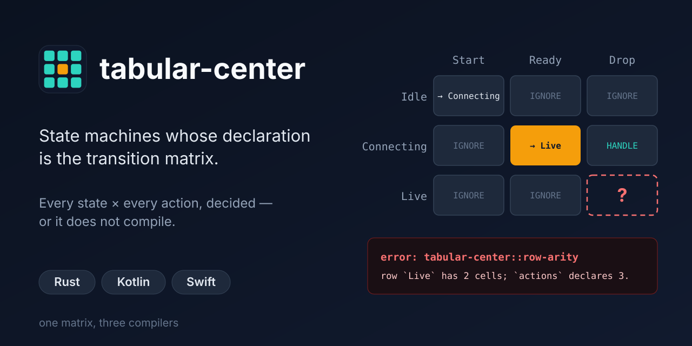

# tabular-center

State machines whose declaration *is* the transition matrix.

**Documentation: <https://tabula.center/>** -- a
page per language ([Rust](doc/rust.md), [Kotlin](doc/kotlin.md),
[Swift](doc/swift.md)), with the same
machine in each, the code you write around it, and what the compiler says when
a cell is missing.

```rust
transition_matrix! {
    machine Timer;
    context Ctx;
    state   State;
    action  Action;
    effects Effect { StartClock, StopClock { reason: u32 } }
    initial Idle;

    states  { Idle, Running { since: u32 }, Done }
    actions { Start, Tick { now: u32 }, Cancel }

    //            Start                              Tick     Cancel
    Idle    => [  HANDLE,                            IGNORE,  IGNORE                             ];
    Running => [  IGNORE,                            HANDLE,  GO!(Idle, StopClock { reason: 0 }) ];
    Done    => [  GO!(Running { since: 0 }, StartClock), IGNORE, IGNORE                          ];
}
```

## The one guarantee

> Every cell of the state x action matrix is a required member.
> **An incomplete machine does not compile.**

Not enforced by pattern-matcher exhaustiveness — that is defeated by `else`,
`default`, `_`, and guard clauses. Not enforced by function purity — that is
unenforceable in Kotlin and Swift, so any claim built on it is broken by a
single `println`. Enforced by the oldest mechanism in every one of these
languages: *you declared a required member and did not implement it.*

States, actions, **and effects** are all generated sum types. Effects too,
because the generator can only demand one handler per effect variant if it
knows the variants — so adding an effect breaks every handler's build, the
same way adding a state breaks every matrix.

## The composition property

> Scoping a total child machine into a total parent yields a total parent,
> and the compiler proves it by the same mechanism as everything else.

A parent hands some of its cells to a child, which is written knowing nothing
about the parent:

```rust
    //            Run                 Tick                Cancel
    Retrying => [ DELEGATE!(retry),   DELEGATE!(retry),   GO!(Done, Log) ];
```

The parent's cell surface requires the child's, so one type implementing the
parent must implement the child too -- a hole in the child is a build error in
the parent, the same error as a hole in the parent itself. No runtime check,
no registration, nothing to forget. It holds in all three languages, each with
a compile-fail fixture proving it (`child_hole_breaks_parent`), and it holds
through colors: a plain child composes into an `async` parent, while an `async`
child under a plain parent does not compile.

## Status

| Phase | Content | State |
|---|---|---|
| 0 | Foundations, flake, CI | done |
| 1 | Rust core, hand-written reference | done |
| 2 | `transition_matrix!` | done, `prototype async fn handle;` included |
| 3 | Cross-language conformance spec | done |
| 4 | Kotlin core + KSP | done; the processor runs under `nix flake check` |
| 5 | Swift core + macro | everything but macro expansion; `MachineSyntax` reads the surface, and the emitter's output is compiled by `swift-codegen` |
| 6 | Composition | done (all three) |
| 7 | Effects surface | done (all three) |
| 8 | Introspection, lints, renderings | done (all three); renderings produced by each and diffed (`renderings-agree`) |
| 9a | Driver and mailbox | done (all three) |

See `ARCHITECTURE.md` for the design, `PLAN.md` for the task breakdown, and
`tabular-center-<lang>/examples/` for the worked machines — the same four core examples in every
language, ordered by what each one adds, plus a few that exist in only one
(a suspend driver, a KSP-generated machine and a Compose Desktop app in Kotlin,
an iced app in Rust, `ObservableStore` and `TabularCenterTesting` in Swift).

## Development

```sh
./tools/verify         # everything CI checks
./tools/verify test    # one step
./tools/verify --list  # every step, and which language owns it

nix develop            # all three toolchains; .#rust, .#kotlin, .#swift for one
nix flake check        # the same steps, sandboxed, as CI runs them
nix flake check ./tabular-center-kotlin   # one language on its own
nix run .#conformance
nix run .#bench        # matrix dispatch vs hand-written, timed
nix run .#tb-fmt       # align every .tb. matrix (-- --check to report only)
nix run .#table-diff

nix run .#release -- 0.1.0   # set the version everywhere, verify, tag
nix run .#publish            # dry run; --execute to ship
```

Each implementation is a flake of its own (`tabular-center-{rust,kotlin,swift}/`,
each with `flake.nix`, `nix/` and `tools/`), and the root `flake.nix` composes
the three; see ARCHITECTURE 12 and 13. `VERSION` is the
single source of truth for the version number and every manifest is derived
from it — three files drifting apart is the normal way a polyglot release goes
wrong.

Without nix: `./tools/verify` runs the same steps `nix flake check` does, and
falls back to rustc's lints where clippy is unavailable.
